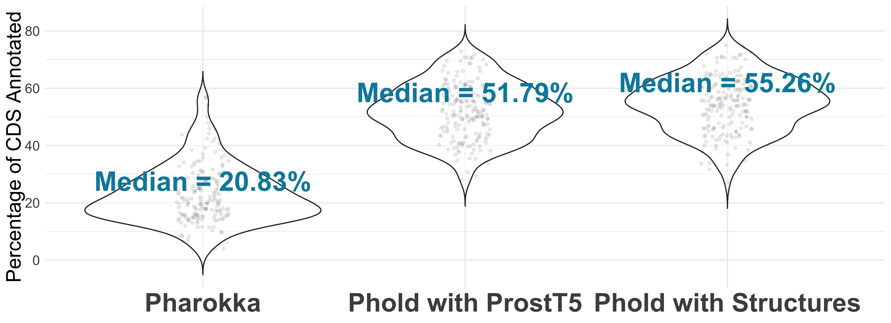
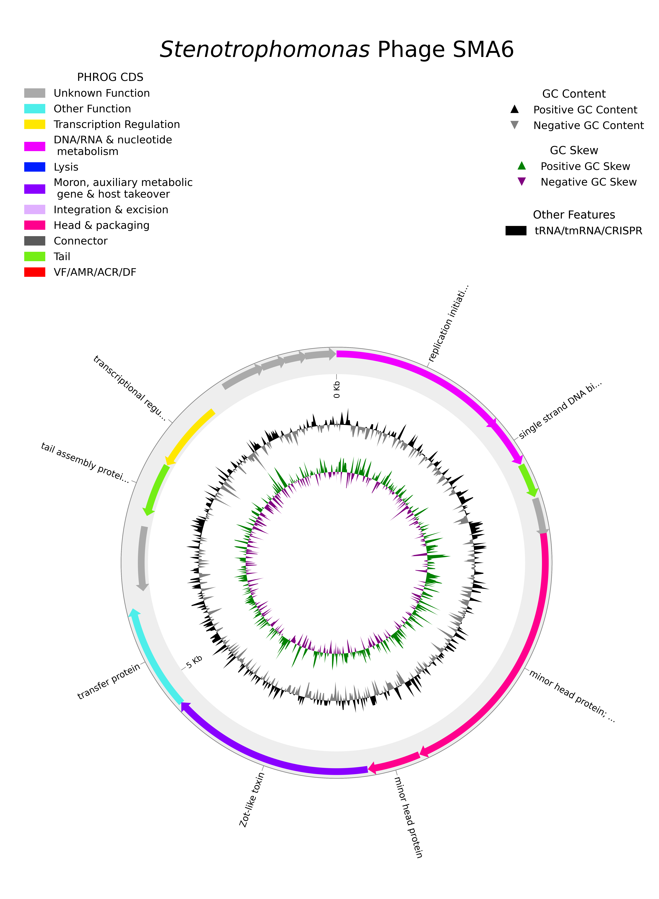

[](https://colab.research.google.com/github/gbouras13/phold/blob/main/run_pharokka_and_phold_and_phynteny.ipynb)

[](https://anaconda.org/bioconda/phold)
[](https://img.shields.io/conda/dn/bioconda/phold)
[](https://badge.fury.io/py/phold)
[](https://pepy.tech/project/phold)

# phold - Phage Annotation using Protein Structures

<p align="center">
  
</p>

`phold` is a sensitive annotation tool for bacteriophage genomes and metagenomes using protein structural homology. 

`phold` uses the [ProstT5](https://github.com/mheinzinger/ProstT5) protein language model to rapidly translate protein amino acid sequences to the 3Di token alphabet used by [Foldseek](https://github.com/steineggerlab/foldseek). Foldseek is then used to search these against a database of over 1 million phage protein structures mostly predicted using [Colabfold](https://github.com/sokrypton/ColabFold). 

Alternatively, you can specify protein structures that you have pre-computed for your phage(s) instead of using ProstT5 with `phold compare`.

Benchmarking is ongoing, but `phold` strongly outperforms [Pharokka](https://github.com/gbouras13/pharokka), particularly for less characterised phages such as those from metagenomic datasets.

The below plot shows the percentage of annotated coding sequences (CDS) for 179 metagenomic phage genomes assembled with [phables](https://github.com/Vini2/phables). Phold v0.2.0 run both in default settings (with ProstT5) settings and where predicted protein structures (with Colabfold) were compared against Pharokka v1.7.0.

<p align="center">
  
</p>

If you have already annotated your phage(s) with Pharokka, `phold` takes the Genbank output of Pharokka as an input option, so you can easily update the annotation with more functional predictions!

# Tutorial

Check out the `phold` tutorial at [https://phold.readthedocs.io/en/latest/tutorial/](https://phold.readthedocs.io/en/latest/tutorial/).

# Google Colab Notebooks

If you don't want to install `phold` locally, you can run it without any code using one of the following Google Colab notebooks:

* To run `pharokka` + `phold` + `phynteny` use [this link](https://colab.research.google.com/github/gbouras13/phold/blob/main/run_pharokka_and_phold_and_phynteny.ipynb)
    * [phynteny](https://github.com/susiegriggo/Phynteny) uses a long-short term memory model trained on phage synteny (the conserved gene order across phages) to assign hypothetical phage proteins to a PHROG category - it might help you add extra PHROG category annotations to hypothetical genes remaining after you run `phold`. 
    * Note: Phynteny will work only if your phage has fewer than 120 predicted proteins
    * You can still use this notebook to run `phold` if your phage(s) are too big - just don't run the Phynteny step!
  
# Table of Contents

- [phold - Phage Annotation using Protein Structures](#phold---phage-annotation-using-protein-structures)
- [Tutorial](#tutorial)
- [Google Colab Notebooks](#google-colab-notebooks)
- [Table of Contents](#table-of-contents)
- [Documentation](#documentation)
- [Installation](#installation)
- [Quick Start](#quick-start)
- [Output](#output)
- [Usage](#usage)
- [Plotting](#plotting)
- [Citation](#citation)

# Documentation

Check out the full documentation at [https://phold.readthedocs.io](https://phold.readthedocs.io).

# Installation

For more details (particularly if you are using a non-NVIDIA GPU), check out the [installation documentation](https://phold.readthedocs.io/en/latest/install/).

The best way to install `phold` is using [mamba](https://github.com/conda-forge/miniforge), as this will install [Foldseek](https://github.com/steineggerlab/foldseek) (the only non-Python dependency) along with the Python dependencies.

To install `phold` using [mamba](https://github.com/conda-forge/miniforge):

```bash
mamba create -n pholdENV -c conda-forge -c bioconda phold 
```

To utilise `phold` with GPU, a GPU compatible version of `pytorch` must be installed. By default conda/mamba will install a CPU-only version. 

If you have an NVIDIA GPU, please try:

```bash
mamba create -n pholdENV -c conda-forge -c bioconda phold pytorch=*=cuda*
```

If you have a Mac running an Apple Silicon chip (M1/M2/M3), `phold` should be able to use the GPU. Please try:

```bash
mamba create -n pholdENV python==3.11  
conda activate pholdENV
mamba install pytorch::pytorch torchvision torchaudio -c pytorch 
mamba install -c conda-forge -c bioconda phold 
```

If you are having trouble with `pytorch` see [this link](https://pytorch.org) for more instructions. If you have an older version of CUDA installed, then you might find [this link useful](https://pytorch.org/get-started/previous-versions/).

Once `phold` is installed, to download and install the database run:

```bash
phold install
```

* Note: You will need at least 8GB of free space (the `phold` databases including ProstT5 are just over 8GB uncompressed).

# Quick Start

* `phold` takes a GenBank format file output from [pharokka](https://github.com/gbouras13/pharokka) or from [NCBI Genbank](https://www.ncbi.nlm.nih.gov/genbank/) as its input by default. 
* If you are running `phold` on a local work station with GPU available, using `phold run` is recommended. It runs both `phold predict` and `phold compare`

``` bash
phold run -i tests/test_data/NC_043029.gbk  -o test_output_phold -t 8
```

* If you do not have a GPU available, add `--cpu`.
* `phold run` will run in a reasonable time for small datasets with CPU only (e.g. <5 minutes for a 50kbp phage).
* However, `phold predict` will complete much faster if a GPU is available, and is necessary for large metagenomic datasets to run in a reasonable time. 

* In a cluster environment, it is most efficient to run `phold` in 2 steps for optimal resource usage.

1. Predict the 3Di sequences with ProstT5 using `phold predict`. This is massively accelerated if a GPU available.

```bash
phold predict -i tests/test_data/NC_043029.gbk -o test_predictions 
```

2. Compare the the 3Di sequences to the `phold` structure database with Foldseek using `phold compare`. This does not utilise a GPU. 

```bash
phold compare -i tests/test_data/NC_043029.gbk --predictions_dir test_predictions -o test_output_phold -t 8 
```

# Output

* The primary outputs are:
  * `phold_3di.fasta` containing the 3Di sequences for each CDS
  * `phold_per_cds_predictions.tsv` containing detailed annotation information on every CDS
  * `phold_all_cds_functions.tsv` containing counts per contig of CDS in each PHROGs category, VFDB, CARD, ACRDB and Defensefinder databases (similar to the `pharokka_cds_functions.tsv` from Pharokka)
  * `phold.gbk`, which contains a GenBank format file including these annotations, and keeps any other genomic features (tRNA, CRISPR repeats, tmRNAs) included from the `pharokka` Genbank input file if provided

# Usage

```bash
Usage: phold [OPTIONS] COMMAND [ARGS]...

Options:
  -h, --help     Show this message and exit.
  -V, --version  Show the version and exit.

Commands:
  citation          Print the citation(s) for this tool
  compare           Runs Foldseek vs phold db
  createdb          Creates foldseek DB from AA FASTA and 3Di FASTA input...
  install           Installs ProstT5 model and phold database
  plot              Creates Phold Circular Genome Plots
  predict           Uses ProstT5 to predict 3Di tokens - GPU recommended
  proteins-compare  Runs Foldseek vs phold db on proteins input
  proteins-predict  Runs ProstT5 on a multiFASTA input - GPU recommended
  remote            Uses Foldseek API to run ProstT5 then Foldseek locally
  run               phold predict then comapare all in one - GPU recommended
```

```bash
Usage: phold run [OPTIONS]

  phold predict then comapare all in one - GPU recommended

Options:
  -h, --help                     Show this message and exit.
  -V, --version                  Show the version and exit.
  -i, --input PATH               Path to input file in Genbank format or
                                 nucleotide FASTA format  [required]
  -o, --output PATH              Output directory   [default: output_phold]
  -t, --threads INTEGER          Number of threads  [default: 1]
  -p, --prefix TEXT              Prefix for output files  [default: phold]
  -d, --database TEXT            Specific path to installed phold database
  -f, --force                    Force overwrites the output directory
  --batch_size INTEGER           batch size for ProstT5. 1 is usually fastest.
                                 [default: 1]
  --cpu                          Use cpus only.
  --omit_probs                   Do not output 3Di probabilities from ProstT5
  --finetune                     Use finetuned ProstT5 model (PhrostT5).
                                 Experimental and not recommended for now
  --finetune_path TEXT           Path to finetuned model weights
  --save_per_residue_embeddings  Save the ProstT5 embeddings per resuide in a
                                 h5 file
  --save_per_protein_embeddings  Save the ProstT5 embeddings as means per
                                 protein in a h5 file
  -e, --evalue FLOAT             Evalue threshold for Foldseek  [default:
                                 1e-3]
  -s, --sensitivity FLOAT        Sensitivity parameter for foldseek  [default:
                                 9.5]
  --keep_tmp_files               Keep temporary intermediate files,
                                 particularly the large foldseek_results.tsv
                                 of all Foldseek hits
  --card_vfdb_evalue FLOAT       Stricter Evalue threshold for Foldseek CARD
                                 and VFDB hits  [default: 1e-10]
  --separate                     Output separate GenBank files for each contig
  --max_seqs INTEGER             Maximum results per query sequence allowed to
                                 pass the prefilter. You may want to reduce
                                 this to save disk space for enormous datasets
                                 [default: 10000]
  --only_representatives         Foldseek search only against the cluster
                                 representatives (i.e. turn off --cluster-
                                 search 1 Foldseek parameter)
  --ultra_sensitive              Runs phold with maximum sensitivity by
                                 skipping Foldseek prefilter. Not recommended
                                 for large datasets.
  ```

# Plotting 

`phold plot` will allow you to create Circos plots with [pyCirclize](https://github.com/moshi4/pyCirclize) for all your phage(s). For example:

```bash
phold plot -i tests/test_data/NC_043029_phold_output.gbk  -o NC_043029_phold_plots -t '${Stenotrophomonas}$ Phage SMA6'  
```

<p align="center">
  
</p>

# Citation

`phold` is a work in progress, a preprint will be coming soon - if you use it please cite the GitHub repository https://github.com/gbouras13/phold for now.

Please be sure to cite the following core dependencies and PHROGs database:

* Pharokka - (https://github.com/gbouras13/pharokka) [Bouras G, Nepal R, Houtak G, Psaltis AJ, Wormald P-J, Vreugde S. Pharokka: a fast scalable bacteriophage annotation tool. Bioinformatics, Volume 39, Issue 1, January 2023, btac776](https://doi.org/10.1093/bioinformatics/btac776)
* Foldseek - (https://github.com/steineggerlab/foldseek) [van Kempen M, Kim S, Tumescheit C, Mirdita M, Lee J, Gilchrist C, Söding J, and Steinegger M. Fast and accurate protein structure search with Foldseek. Nature Biotechnology, doi:10.1038/s41587-023-01773-0 (2023)](https://www.nature.com/articles/s41587-023-01773-0)
* ProstT5 - (https://github.com/mheinzinger/ProstT5) [Michael Heinzinger, Konstantin Weissenow, Joaquin Gomez Sanchez, Adrian Henkel, Martin Steinegger, Burkhard Rost. ProstT5: Bilingual Language Model for Protein Sequence and Structure. bioRxiv doi:10.1101/2023.07.23.550085 (2023)](https://www.biorxiv.org/content/10.1101/2023.07.23.550085v1)
* Colabfold - (https://github.com/sokrypton/ColabFold) [Mirdita M, Schütze K, Moriwaki Y, Heo L, Ovchinnikov S and Steinegger M. ColabFold: Making protein folding accessible to all. Nature Methods (2022) doi: 10.1038/s41592-022-01488-1 ](https://www.nature.com/articles/s41592-022-01488-1)
* PHROGs - (https://phrogs.lmge.uca.fr) [Terzian P., Olo Ndela E., Galiez C., Lossouarn J., Pérez Bucio R.E., Mom R., Toussaint A., Petit M.A., Enault F., "PHROG : families of prokaryotic virus proteins clustered using remote homology", NAR Genomics and Bioinformatics, (2021) https://doi.org/10.1093/nargab/lqab067](https://doi.org/10.1093/nargab/lqab067)

Please also consider citing these supplementary databases where relevant:

* [CARD](https://card.mcmaster.ca) - [Alcock B.P. et al, CARD 2023: expanded curation, support for machine learning, and resistome prediction at the Comprehensive Antibiotic Resistance Database Nucleic Acids Research (2022) https://doi.org/10.1093/nar/gkac920](https://doi.org/10.1093/nar/gkac920)
* [VFDB](http://www.mgc.ac.cn/VFs/main.htm) - [Chen L., Yang J., Yao Z., Sun L., Shen Y., Jin Q., "VFDB: a reference database for bacterial virulence factors", Nucleic Acids Research (2005) https://doi.org/10.1093/nar/gki008](https://doi.org/10.1093/nar/gki008)
* [Defensefinder](https://defensefinder.mdmlab.fr) - [ F. Tesson,  R. Planel, A. Egorov, H. Georjon,  H. Vaysset,  B. Brancotte,  B. Néron,  E. Mordret,  A Bernheim,  G. Atkinson,  J. Cury. A Comprehensive Resource for Exploring Antiphage Defense: DefenseFinder Webservice, Wiki and Databases. bioRxiv (2024) https://doi.org/10.1101/2024.01.25.577194](https://doi.org/10.1101/2024.01.25.577194)
* [acrDB](https://bcb.unl.edu/AcrDB/) - please cite the original acrDB database paper [Le Huang, Bowen Yang, Haidong Yi, Amina Asif, Jiawei Wang, Trevor Lithgow, Han Zhang, Fayyaz ul Amir Afsar Minhas, Yanbin Yin, AcrDB: a database of anti-CRISPR operons in prokaryotes and viruses. Nucleic Acids Research (2021) https://doi.org/10.1093/nar/gkaa857](https://doi.org/10.1093/nar/gkaa857) AND the paper that generated the structures for these protein used by `phold` [Harutyun Sahakyan, Kira S. Makarova, and Eugene V. Koonin. Search for Origins of Anti-CRISPR Proteins by Structure Comparison. The CRISPR Journal (2023)](https://doi.org/10.1089/crispr.2023.0011)
* [Netflax](http://netflax.webflags.se) - [Karin Ernits, Chayan Kumar Saha, Tetiana Brodiazhenko, Bhanu Chouhan, Aditi Shenoy, Jessica A. Buttress, Julián J. Duque-Pedraza, Veda Bojar, Jose A. Nakamoto, Tatsuaki Kurata, Artyom A. Egorov, Lena Shyrokova, Marcus J. O. Johansson, Toomas Mets, Aytan Rustamova, Jelisaveta Džigurski, Tanel Tenson, Abel Garcia-Pino, Henrik Strahl, Arne Elofsson, Vasili Hauryliuk, and Gemma C. Atkinson, The structural basis of hyperpromiscuity in a core combinatorial network of type II toxin–antitoxin and related phage defense systems. PNAS (2023) https://doi.org/10.1073/pnas.2305393120](https://doi.org/10.1073/pnas.2305393120) 
* [Netflax](http://netflax.webflags.se) - [Karin Ernits, Chayan Kumar Saha, Tetiana Brodiazhenko, Bhanu Chouhan, Aditi Shenoy, Jessica A. Buttress, Julián J. Duque-Pedraza, Veda Bojar, Jose A. Nakamoto, Tatsuaki Kurata, Artyom A. Egorov, Lena Shyrokova, Marcus J. O. Johansson, Toomas Mets, Aytan Rustamova, Jelisaveta Džigurski, Tanel Tenson, Abel Garcia-Pino, Henrik Strahl, Arne Elofsson, Vasili Hauryliuk, and Gemma C. Atkinson, The structural basis of hyperpromiscuity in a core combinatorial network of type II toxin–antitoxin and related phage defense systems. PNAS (2023) https://doi.org/10.1073/pnas.2305393120](https://doi.org/10.1073/pnas.2305393120) 


